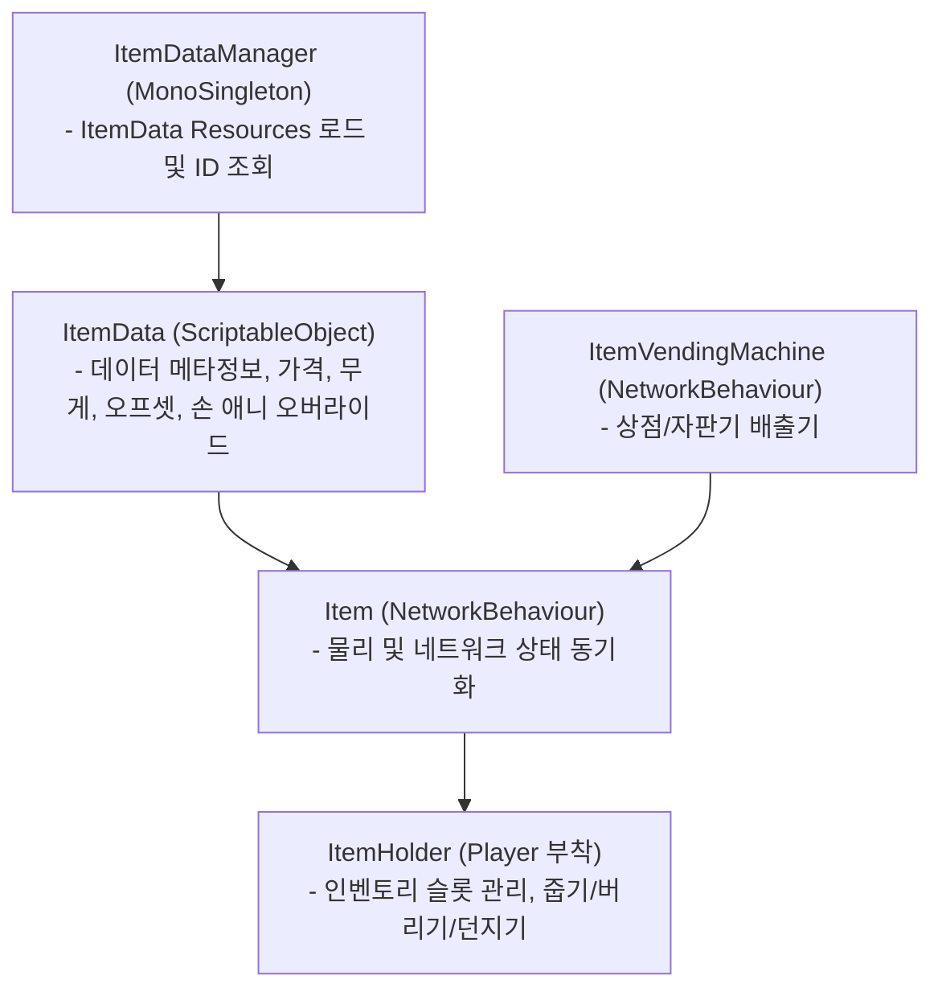

# 아이템 시스템 위키 (Item System Architecture)

> 본 문서는 `ExplosiveFactory`의 아이템 시스템 아키텍처, 상태 머신, 인벤토리 파이프라인 및 자판기 메커니즘을 상세히 설명합니다.

---

## 1. 핵심 컴포넌트 구조

---

## 2. 아이템 생명주기 및 상태 동기화

아이템은 다음 세 가지 상태를 안정적으로 전환하며 네트워크 상에 동기화됩니다:

1. **`Grounded` (바닥에 놓인 상태):**
   - 물리(`Rigidbody`, `isKinematic = false`) 및 모든 자식 콜라이더(`Collider`) 활성화.
   - `RpcOnItemDropped`를 통해 렌더러 활성화 및 물리 속도(`linearVelocity`)가 즉각 적용되어 동기화됨.
   - 플레이어의 `InteractiveRaycast`에 감지되어 `F` 키로 주울 수 있음 (`CmdPickUpItem`).

2. **`Held` / `Inventory` (인벤토리 슬롯 및 손에 쥐어진 상태):**
   - `RpcOnItemPickedUp`을 통해 렌더러 숨김 및 **모든 자식 콜라이더 비활성화**, `Rigidbody.isKinematic = true`.
   - 바닥에 투명 충돌체가 남아 시야 레이캐스트나 플레이어 이동을 가로막는 버그를 원천 차단.
   - `ItemHolder`의 `RpcSetSlotItem` 및 `RpcSetHandyItemIndex`를 통해 지연 없는 즉시 슬롯 교체 및 파지 상태 동기화 (SyncVar 미사용, 순서 보장).
   - 활성 슬롯의 아이템에 맞춰 로컬 `PoolManager`에서 1인칭 손 / 3인칭 몸통 소켓(`HandyItemObject`)을 생성하고 오버라이드 애니메이터 적용.

3. **`Thrown` / `Dropped` (버려지거나 던져진 상태):**
   - 손 소켓의 `HandyItemObject`를 풀로 안전하게 반환.
   - 서버에서 `DropItem(pos, rot, velocity)` 호출 ➔ `RpcOnItemDropped`를 통해 전방 추진력(`linearVelocity`) 부여 및 물리/콜라이더 즉각 복구.
   - `NetworkPoolManager.Release` 시 Mirror의 `UnSpawnHandler`를 거쳐 풀로 회수.

---

## 3. 아이템 파생 클래스 분류

- **`HandyItemObject` / `FlashLightHandyItemObject`:**
  - 손에 쥔 상태에서 좌클릭(`UsePrimary`) / 우클릭(`UseSecondary`) 시 즉시 고유 기능 발동 (예: 손전등 빛 On/Off 토글).
- **`ToggleHoldItem` / `PhoneItem`:**
  - 우클릭 유지 또는 토글 시 플레이어 화면 앞쪽으로 아이템을 들어 올리고 UI 모드 진입 (스마트폰 앱 조작).
- **`NomalItem`:**
  - 별도 기능 없이 운반, 판매, 자판기 재료 투입 등의 용도로 사용되는 일반 화물 아이템.

---

## 4. 조작 키 매핑 (Keybindings)

| 키 입력 | 조작 내용 | 처리 클래스 |
|---|---|---|
| **`F`** | 시선 앞의 아이템 줍기 (`TryPickup`) / 자판기 상호작용 | `PlayerItemInteraction` / `InteractiveRaycast` |
| **`G`** | 현재 들고 있는 아이템 바닥에 버리기 (`TryDrop`) | `ItemHolder` |
| **`마우스 좌클릭`** | 들고 있는 아이템 주 기능 사용 (`UsePrimary`) | `Item` / `HandyItemObject` |
| **`마우스 우클릭`** | 들고 있는 아이템 보조 기능 / UI 토글 (`UseSecondary`) | `Item` / `ToggleHoldItem` |
| **`마우스 휠`** | 인벤토리 슬롯 번호 변경 및 손에 쥔 아이템 스왑 | `ItemHolder` |

---

## 5. 시선 감지 및 아웃라인 시스템 (Outline System)

- **원리:** 플레이어 시선(`InteractiveRaycast`)이 오브젝트에 닿으면 `IInteractable.OnWatch()`가 호출됩니다.
- **렌더링 방식 (URP Render Feature):**
  - 오브젝트의 레이어를 변경하거나 기존 머티리얼을 수정하지 않습니다.
  - `InteractableObject`가 `OutlineManager.Show(CachedRenderers)`를 호출하여 활성 렌더러를 등록합니다.
  - `OutlineRenderFeature`가 타겟 렌더러들의 실루엣을 마스크 버퍼에 렌더링하고, 화면 후처리(Blit) 엣지 디텍션을 통해 매끄러운 외곽선을 합성합니다.
  - 시선이 벗어나거나(`OnNotWatch`), 아이템이 주워지면(`OnDisable`) 자동으로 렌더러가 등록 해제되어 렌더링 비용이 발생하지 않습니다.

---

## 6. 인게임 인벤토리 HUD UI (`InventoryUI` & `InventorySlotUI`)

- **슬롯 구조:** 화면 하단 중앙에 기본 3개(`_maxHandyItemIndex`) 슬롯 오버레이.
- **슬롯 상태 표시:**
  - 현재 파지 중인 슬롯: 골드 테두리 및 스케일 업 하이라이트.
  - 슬롯 번호(`[1]`, `[2]`, `[3]`) 및 아이템 이름 표시.
- **반응형 이벤트 파이프라인:** `ItemHolder`의 `OnCurrentSlotChanged`, `OnSlotItemChanged`, `OnAllSlotsUpdated` 이벤트를 구독하여 마우스 휠 변경, 줍기(`F`), 버리기(`G`) 시 프레임 지연 없이 즉시 UI 갱신.
- **자동 HUD 생성 및 바인딩:** `LocalPlayerSetter`가 로컬 플레이어 시작 시 씬의 `InventoryUI`를 자동 탐색 및 바인딩 (없을 경우 런타임 자동 생성).

---

## 7. 아이템 생성 규칙 (SSOT)
- 신규 아이템 추가 시에는 반드시 [신규 아이템 생성 스킬 (create-item)](../../skills/create-item/SKILL.md)의 단계별 절차를 준수합니다.
- 모든 스폰 프리팹은 반드시 **`Assets/Resources/Network/Item_{Name}.prefab`**에 위치해야 합니다.
